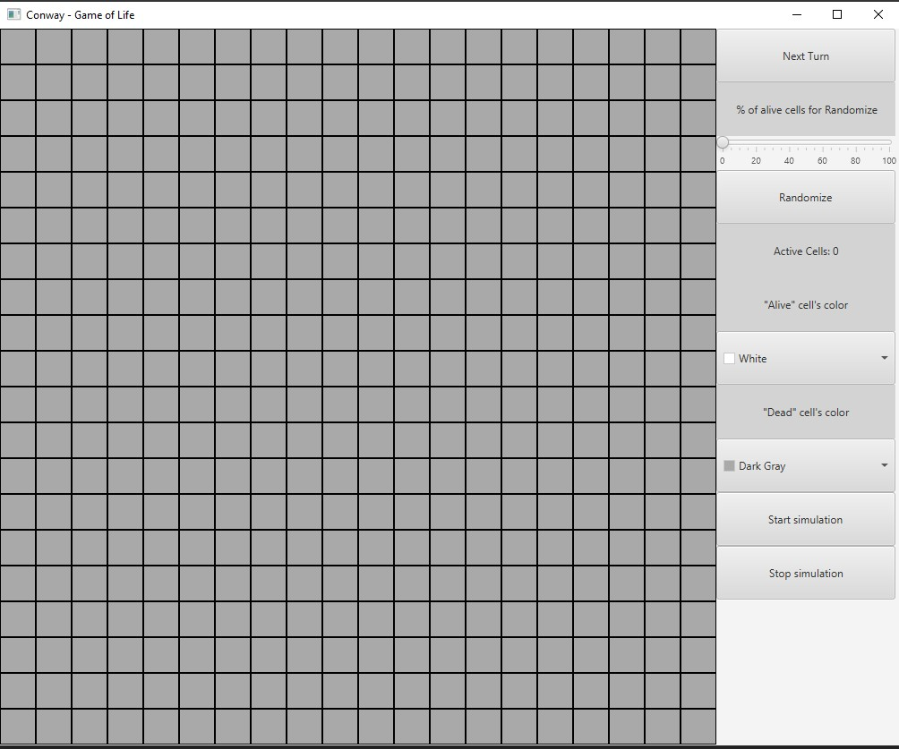
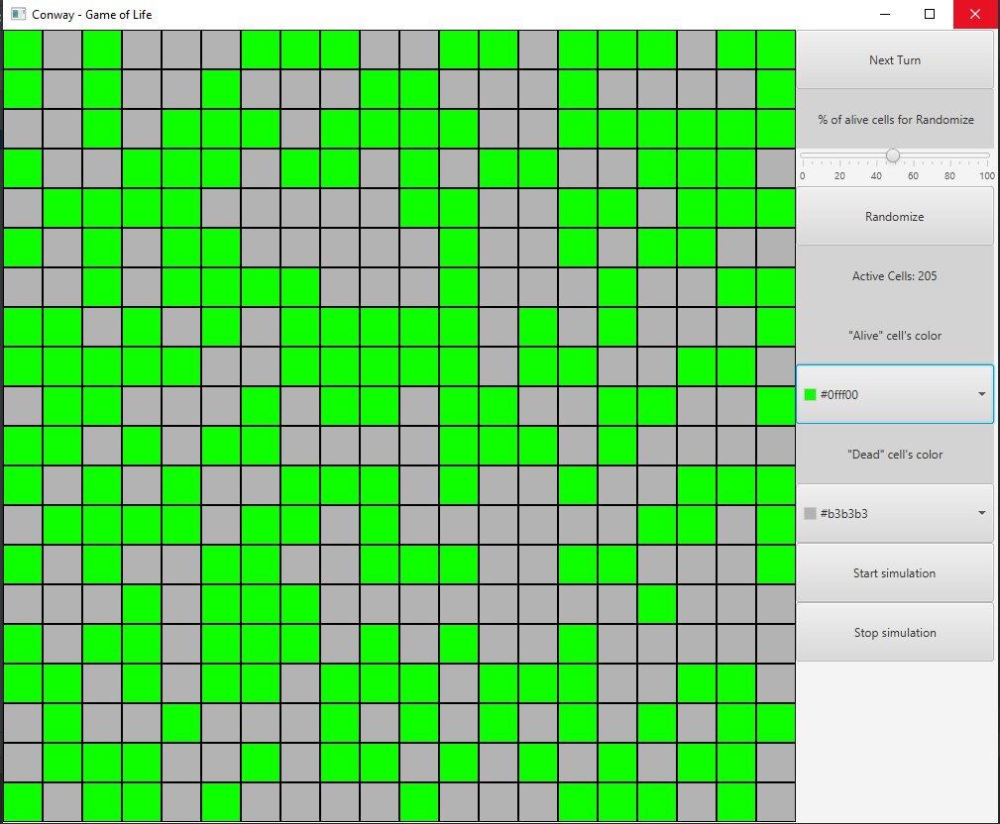

# Conway - Game-of-life
Pierwotnie jedno z paru zadań programistycznych na czwartym semestrze studiów, które dotyczyło zrobienia prostej aplikacji pozwalajacej pokazac zmiany zachodzace w strukturach komorek na przestrzeni kolejnych jednostek czasu. Po umieszczeniu projektu na githubie nieco go jeszcze potem zrefraktoryzowalem ze wzgledu na duży bałagan w kodzie. Projekt został zrealizowany w języku Java z wykorzystaniem bibliotek JavaFX. 

## Zalozenia "Game of Life"
* Martwa komórka, która ma dokładnie 3 żywych sąsiadów, staje się żywa w następnej jednostce czasu (rodzi się).
* Żywa komórka z 2 albo 3 żywymi sąsiadami pozostaje nadal żywa; przy innej liczbie sąsiadów umiera (z „samotności” albo „zatłoczenia”).

## Funkcjonalności aplikacji
* Mozliwosc dowolnego oznaczania komorek na planszy jako zywe badz martwe
* Mozliwosc przejscia do kolejnej "Tury" gdzie plansza z komorkami ulegnie zmiany.
* Mozliwosc rozpoczecia symuacji pokazujacej ewolucje komorek( plansza odswieza sie co sekunde)
* Mozliwosc customizacji kolorow komorek w zaleznosci od ich stanu
* Mozliwosc wygenerowania losowego stanu planszy w oparciu o wyznaczony procent "zywych" pol

### Startowy ekran aplikacji

### Ekran aplikacji podczas wlaczonej symulacji

